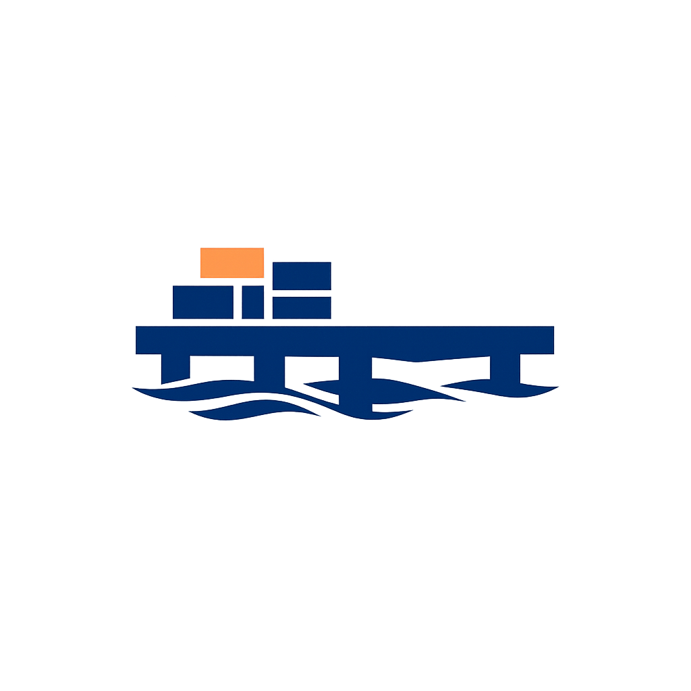

<p align="center">
  
</p>

<h1 align="center">pier</h1>

<p align="center">
  Personal cross-platform CLI for Laravel Docker dev + production deploys.<br />
  One command from a fresh Laravel repo to a production deploy with health checks and automatic rollback.
</p>

<p align="center">
  <a href="https://github.com/Bonnary/pier/releases"></a>
  <a href="https://github.com/Bonnary/pier/blob/main/LICENSE"></a>
  <a href="https://golang.org"></a>
  <a href="https://github.com/Bonnary/pier/actions"></a>
  <a href="https://github.com/Bonnary/pier/issues"></a>
  
</p>

---

`pier` turns a Laravel project into a fully provisioned dev + production
Docker stack with one-command deploys, health checks, and automatic
rollback. It is a single, self-contained Go binary — no Composer
dependency, no daemon, no telemetry, no network calls beyond SSH and the
Docker CLI.

> **Status:** `v0.0.4-beta` — under active development. The Laravel
> stack is feature-complete for the documented workflows; other stacks
> (Node, Python, Rails, etc.) are explicitly out of scope for v1.

---

## Table of contents

- [Features](#features)
- [Prerequisites](#prerequisites)
- [Installation](#installation)
- [Quickstart](#quickstart)
- [Commands](#commands)
- [Configuration (`pier.toml`)](#configuration-piertoml)
- [Project structure](#project-structure)
- [Development](#development)
- [Manual verification checklist](#manual-verification-checklist)
- [Troubleshooting](#troubleshooting)
- [Contributing](#contributing)
- [Roadmap](#roadmap)
- [License](#license)
- [Acknowledgements](#acknowledgements)

---

## Features

- **`pier init`** — Detect Laravel, write `pier.toml`, generate
  `docker-compose.yml`, runtime Dockerfiles, and a matching
  `vite.config.ts` patch in one pass. Smart-merges into an existing
  `docker-compose.yml` with warn-and-confirm on unknown keys. Asks
  the full deploy setup too: host, user, path, branch, and the build
  machine (`host_server` / `local_machine` / `build_server`, plus
  build host/user/path when `build_server` is chosen).
- **`pier dev` / `pier stop`** — Bring up (or stop) the dev stack
  with a pre-flight port probe and a clear ready block.
- **`pier shell [env]` / `pier exec [env] <cmd...>`** — Interactive
  bash in the `laravel.test` container, or one-off commands in it
  (e.g. `pier exec php artisan migrate`). Add a deploy env name to
  target the remote host instead: `pier shell production` opens an
  interactive bash in the production `app` container (PTY, resize
  forwarding); `pier exec production php artisan migrate` runs a
  one-off command there. Remote exit codes propagate to pier's exit
  code.
- **`pier service [env]`** — Manage auxiliary services with an
  interactive picker: `pier service` edits `[stack].services` (dev);
  `pier service <env>` edits that env's services, overriding
  `[stack].services` for the deploy target (e.g. SeaweedFS in dev,
  AWS S3 in prod). Removed services are torn down on the server by
  the next deploy.
- **`pier deploy <env>`** — Build, sync, up, health-check, and
  commit a production image tag over SSH. A Bubble Tea TUI shows
  live phase progress. Key auth is tried first; password-only
  servers get an interactive prompt. The image is built on the
  deploy host by default; `pier init` can pick `local_machine` or
  `build_server`, which stream the finished image to the host over
  SSH (`docker save` → `docker load`) in a `transfer` deploy phase —
  no registry, no temp files.
- **`pier bootstrap [env...]`** — One-time server provisioning:
  installs Docker Engine + the compose plugin over SSH and grants
  the deploy user passwordless docker access (hidden one-time sudo
  password prompt; installation output streams live; idempotent,
  `--all` / `--force`). Also creates each env's deploy directory
  (`[deploy.<env>].path`) and hands it to the deploy user, so
  `pier deploy` never hits a missing-path "not writable" error.
  When `[deploy.<env>].builder = "build_server"`, the same
  invocation also provisions the build server and its `build_path`.
- **Automatic rollback** — Any failure in the `up`, `after_deploy`,
  or `health` phase re-tags the previous image and re-deploys it
  before the command exits non-zero. On a first deploy there is no
  previous image, so the failure itself is reported instead.
- **`pier rollback <env>`** — Re-deploy the previous image tag on
  demand.
- **`pier status [env]`** — One-glance project + container status, locally or on a remote deploy host (containers, disk, health, last deploy).
- **Dev-only sidecars** — `[dev.services.<name>]` in `pier.toml` for
  opt-in dev-only services (log viewers, Reverb, dump inspectors,
  etc.). Never appear in the production compose.
- **Cross-platform** — Single static binary for macOS, Linux, and
  Windows.
- **No background daemon** — `pier` is a one-shot CLI. `docker
  compose up -d` does the lifting between calls.
- **No vendor lock-in** — pier does not depend on `laravel/sail`, does
  not run `sail:install`, and does not touch `vendor/`.

---

## Prerequisites

- **Go 1.25+** — only required if you are building from source.
  Pre-built binaries are available on the
  [releases page](https://github.com/Bonnary/pier/releases).
- **Docker Engine 24+** with the `docker compose` plugin (Docker
  Desktop on macOS/Windows; Docker Engine on Linux). On remote
  servers this comes from `pier bootstrap <env>` — the deploy user
  needs password-protected sudo once for the one-time install.
- **SSH access to the deploy host.** `pier` uses the host's
  `~/.ssh/id_ed25519` by default; override with `$DEPLOY_SSH_KEY`.
  If the server rejects the key, `pier` falls back to a one-time
  interactive password prompt (echo disabled; never stored). File
  sync runs over SFTP on pier's own connection — no local `ssh` or
  `rsync` binaries are required.
- **A Laravel project** — `pier init` requires a `composer.json`
  that requires `laravel/framework` and an `artisan` file at the
  project root.

---

## Installation

### From source (recommended)

```bash
go install github.com/Bonnary/pier/cmd/pier@latest
```

This installs the `pier` binary into `$GOBIN` (or
`$GOPATH/bin`, defaulting to `~/go/bin`).

### Pre-built binaries

Download the archive for your platform from the
[releases page](https://github.com/Bonnary/pier/releases), extract
it, and move the binary onto your `$PATH`:

```bash
# macOS (Apple Silicon)
curl -L -o pier.tar.gz \
  https://github.com/Bonnary/pier/releases/latest/download/pier_darwin_arm64.tar.gz
tar -xzf pier.tar.gz
sudo mv pier /usr/local/bin/

# Linux (x86_64)
curl -L -o pier.tar.gz \
  https://github.com/Bonnary/pier/releases/latest/download/pier_linux_amd64.tar.gz
tar -xzf pier.tar.gz
sudo mv pier /usr/local/bin/

# Windows (PowerShell)
Invoke-WebRequest -Uri "https://github.com/Bonnary/pier/releases/latest/download/pier_windows_amd64.zip" -OutFile pier.zip
Expand-Archive pier.zip
Move-Item pier.exe $env:USERPROFILE\bin\
```

### Build from a local clone

```bash
git clone https://github.com/Bonnary/pier
cd pier
go build -o pier ./cmd/pier
sudo mv pier /usr/local/bin/
```

### Verify

```bash
pier --version
# pier 0.0.4-beta
```

---

## Quickstart

```bash
cd my-laravel-app

# 1. Initialize pier (writes pier.toml, docker-compose.yml, runtime Dockerfiles,
#    and patches vite.config.ts so the Vite dev server is reachable from the host).
pier init

# 2. Bring up the dev stack.
pier dev

# 3. Open a shell in laravel.test, or run a one-off command.
pier shell                        # interactive bash in laravel.test
pier exec php artisan migrate
pier shell production             # interactive bash in the prod app container
pier exec production php artisan migrate   # one-off command on prod

# 4. Manage aux services (e.g. redis) — interactive picker;
#    `pier service production` edits prod services.
pier service
pier service production

# 5. Deploy to production — `pier init` already scaffolded [deploy.production]
#    with your chosen services; fill in host/user/path/branch, then:
pier deploy production

# 6. Roll back if a deploy misbehaves.
pier rollback production

# 7. Check the state of any env at a glance.
pier status
```

`pier init` writes:

- `pier.toml` — pier's project config.
- `docker-compose.yml` — dev stack (smart-merged into an existing
  one with warn-and-confirm on unknown keys).
- `docker/<php>/Dockerfile` and matching runtime files — pier-owned,
  forked from Laravel Sail.
- `.devcontainer/devcontainer.json` — when `pier init --devcontainer`
  is passed.

It also patches `vite.config.ts` to set `server: { host: true }` so
the Vite dev server is reachable from the host through the Docker
port forward.

---

## Commands

| Command | Description |
| --- | --- |
| `pier init [path]` | Detect Laravel, write `pier.toml`, generate `docker-compose.yml` + runtime, patch `vite.config.ts`. Prompts for the deploy target (host/user/path, branch defaulting to main) and the build machine; `--builder` / `--host` / `--user` / `--path` / `--build-host` / `--build-user` / `--build-path` skip the prompts. |
| `pier init --devcontainer` | Also generate `.devcontainer/devcontainer.json` for VS Code. |
| `pier dev` | Bring up the dev stack. Runs a pre-flight port probe; exits with code 6 if a pier-owned host port is taken. |
| `pier stop` | Stop the dev stack (volumes preserved). |
| `pier shell [env]` | Interactive `bash` in the `laravel.test` container, or in the remote `app` container when `<env>` names a deploy host (PTY, resize forwarding). |
| `pier exec [env] <cmd...>` | Run a one-off command in `laravel.test`, or in the remote `app` container when the first arg names a deploy env. |
| `pier service [env]` | Open the init-style services picker (current list pre-ticked); `pier service` edits dev services, `pier service <env>` edits `[deploy.<env>].services` (inherits `[stack]` until first edit). Removed remote services are torn down on the next deploy. |
| `pier deploy <env>` | Build, sync, up, health-check; rollback on failure. Renders a Bubble Tea TUI with live phase progress. |
| `pier bootstrap [env...]` | Provision one or more servers: install Docker + compose plugin, grant the deploy user docker access. Interactive picker when no env is given; `--all` for every env, `--force` to re-provision. |
| `pier rollback <env>` | Re-deploy the previous image tag. |
| `pier status [env]` | Show project and container status; pass an env name to probe the remote host over SSH (containers, disk, health, last deploy). |

### Global flags

| Flag | Description |
| --- | --- |
| `--config <path>` | Path to `pier.toml` (default: `pier.toml`). |
| `--json` | Emit one JSON object per line per event (machine-readable deploy logs). |
| `--verbose` | Unfiltered Docker build output. |

---

## Configuration (`pier.toml`)

A minimal `pier.toml`:

```toml
[project]
name = "myapp"
domain = "myapp.example.com"

[stack]
type  = "laravel"
php   = "8.3"
node  = "22"
services = ["redis", "mailpit"]

[dev]
# bind = "0.0.0.0"   # uncomment to expose dev ports to your LAN (default: 127.0.0.1)

[dev.ports]
laravel = 8000
vite    = 5173
redis   = 6379

[deploy.production]
host   = "prod.example.com"
user   = "deploy"
path   = "/srv/myapp"
branch = "main"
services = ["redis", "queue"]   # optional; absent = inherit [stack].services
tls    = false   # false (default): plain HTTP. true: HTTPS URLs + 443 — requires the upcoming cert feature
before_deploy = ["php artisan down"]              # runs in the app container before the new release starts
after_deploy = ["php artisan migrate --force"]    # runs in the app container after the new release is up

[deploy.production.ports]
laravel = 443   # only the keys the user writes are applied
```

`[deploy.<env>]` fields: `host`, `user`, `path`, `branch`, optional
`tls`, and optional `ports` overrides. `tls = false` (the default)
serves plain HTTP end-to-end: the deploy health check probes
`http://<host-ip>:<laravel-port>/up` directly on the deploy host IP,
so it passes before DNS or `/etc/hosts` entries point the domain at
the server. The deploy "done" URL prints the project domain, but
falls back to the deploy host IP when the domain does not resolve
yet, so the printed URL is always usable. `tls = true` renders HTTPS
URLs and the 443 mapping, but SSL certificate provisioning is not
shipped yet — keep it `false` for now.

`[deploy.<env>].builder` chooses where the production image is built.
`"host_server"` (the default when the key is absent) builds on the
deploy host itself. `"local_machine"` builds on the machine running
`pier` (Docker required locally). `"build_server"` builds on a
dedicated machine configured with `build_host`, `build_user`, and
`build_path` (the path the source tree is synced to and built in).
Both image modes sync only the deploy files (`docker-compose.prod.yml`,
`.env.production`, `docker/nginx/default.conf`) to the host, stream
the built image over SSH, and render the prod compose with
`image: <project>:current` instead of a build context. `pier bootstrap
<env>` provisions both the host and the build server when
`build_server` is set. The build server is not a deploy env: it lives
inside `[deploy.<env>]` and has no `[deploy.build]` section, so
`pier shell build` (or `pier exec build` / `pier status build`)
errors with `no [deploy.build] section in pier.toml`.

`[deploy.<env>].services` optionally overrides `[stack].services`
for that env (same `services = [...]` style). When absent the env
inherits the stack list; an explicit empty list means no sidecars.
`pier service <env>` edits this list with an interactive picker; the
next `pier deploy <env>` re-renders `docker-compose.prod.yml` from
it (preserving hand-written edits), and containers of removed
services are stopped and removed on the server (their volumes are
kept). Use it to run SeaweedFS in dev but AWS S3 in production, or
MySQL locally with Postgres on the server.

`[deploy.<env>]` also accepts optional `before_deploy` and
`after_deploy` command lists. Each entry runs inside the app
container on the deploy host (`docker compose exec -T app`, the same
mechanism as `pier exec <env>`). `before_deploy` runs after the image
build while the old release is still serving; `after_deploy` runs
after `docker compose up --wait` (compose returns only once every
service with a healthcheck — postgres, redis, the sidecars — is
healthy, so a still-initializing database on a fresh volume can't
race the first `after_deploy` command; a `--wait-timeout 120` bounds
the wait) and the nginx reload, before the health probe. Commands run
in order and stop at the first failure: a
failing command aborts the deploy (exit code 7), so a broken hook is
never silently swallowed. `before_deploy` failures leave the old
release serving; `after_deploy` failures roll back to the previous
image when one exists — on a first deploy there is nothing to roll
back to, so the hook error is reported directly (exit code 7) instead
of a dead-end "no previous deploy" message. Migrations are best
placed in `after_deploy`, where a failed migration fails the deploy
loudly. On a first deploy the app
container does not exist yet, so `before_deploy` is skipped entirely —
put first-run setup in `after_deploy`. `pier init` writes both keys
commented out.

### `[dev.services.<name>]` — opt-in dev sidecars

Anything you want to run locally but not in production — a log
viewer, Reverb, a dump inspector, a sidecar Postgres for tests, etc.
These are merged into `docker-compose.yml` and never appear in
`docker-compose.prod.yml`.

```toml
[dev.services.reverb]
image       = "laravel/reverb:latest"
ports       = ["8080:8080"]
environment = { BROADCAST_CONNECTION = "reverb" }
restart     = "unless-stopped"

[dev.services.log-viewer]
image = "grahamcampbell/php-fpm-log-viewer:latest"
ports = ["8081:80"]
```

---

## Project structure

```
pier/
├── cmd/pier/                 # entry point (main.go)
├── internal/
│   ├── assets/               # go:embed for the logo
│   ├── cli/                  # cobra command tree
│   ├── compose/              # YAML generation + smart-merge
│   ├── config/               # pier.toml parser
│   ├── deploy/               # SSH (key+password), SFTP sync, health, rollback
│   ├── docker/               # thin wrapper around `docker compose`
│   ├── portcheck/            # pre-flight host port probe
│   ├── stack/                # Stack interface + registry
│   │   └── laravel/          # v1 implementation
│   └── tui/                  # Bubble Tea screens
├── assets/
│   └── logo.png              # embedded into the binary
├── docs/superpowers/         # design specs and implementation plans
├── go.mod
├── LICENSE
└── README.md
```

### Boundary rules

- `cli` never calls Docker directly; it goes through `docker` or
  `deploy`.
- `stack/laravel` never imports SSH or Docker; it returns `Files`
  and lets the caller write/exec them.
- `deploy` never knows about Laravel; it just syncs files (SFTP), runs
  commands, and probes.

---

## Development

### Build

```bash
go build -o pier ./cmd/pier
```

### Test

```bash
# Unit tests (macOS, Linux, Windows)
go test -race -coverprofile=coverage.txt -covermode=atomic ./...

# Integration tests (Linux only — needs Docker)
go test -tags=integration -timeout 15m ./internal/deploy/...
```

CI runs unit tests on macOS, Linux, and Windows, and integration
tests on Linux only. See [`.github/workflows/`](.github/workflows/).

### Lint

```bash
golangci-lint run
```

The repo ships a [`.golangci.yml`](.golangci.yml) configuration.

### Cross-compile

```bash
GOOS=darwin  GOARCH=arm64 go build -o pier_darwin_arm64   ./cmd/pier
GOOS=linux   GOARCH=amd64 go build -o pier_linux_amd64    ./cmd/pier
GOOS=windows GOARCH=amd64 go build -o pier_windows_amd64.exe ./cmd/pier
```

### Go doc

Every package, exported type, function, and method has a Go doc
comment. Browse the full reference with:

```bash
go doc ./...
```

---

## Manual verification checklist

Run through this list locally before pushing changes (see
[Contributing](#contributing)) and again before tagging a release.

- [ ] `pier init` on a fresh Laravel project (no existing compose)
- [ ] `pier init` on a project that already has a `docker-compose.yml`
  (smart-merge path; verify user services are preserved)
- [ ] `pier init` on a project with an unknown top-level key in
  `docker-compose.yml` (warn-and-confirm path)
- [ ] `pier service` — open the picker, add and remove a service,
  verify `pier.toml` + `docker-compose.yml` update; `pier service
  production` edits `[deploy.production].services` (idempotent —
  re-running with the same selection prints `no changes`)
- [ ] `pier init --devcontainer` in VS Code; reopen in container
- [ ] `pier shell` and `php artisan migrate` from inside
- [ ] `pier exec php artisan --version` from the host
- [ ] `pier dev` with `[dev] bind = "0.0.0.0"` in `pier.toml` —
  LAN-exposure warning printed, ready block shows `0.0.0.0`, port
  reachable from another device on the LAN; remove the line and
  re-run — warning gone, ready block shows `127.0.0.1`, port not
  reachable
- [ ] `pier bootstrap <env>` on a fresh VPS with key auth + password
  sudo — hidden prompt, get.docker.com progress streams live, Docker
  installed (`docker info` works for the deploy user afterwards),
  `production: done` printed; re-run prints `already bootstrapped —
  skipping`; `--force` re-provisions; the deploy path exists and is
  owned by the deploy user
- [ ] `pier bootstrap <env>` with `builder = "build_server"` — host
  and build server both provisioned, two `done` lines printed
- [ ] `pier deploy <env>` on an un-bootstrapped server fails fast with
  the bootstrap hint; after bootstrap it completes without any
  password prompt
- [ ] `pier bootstrap <env>` against a server with a deliberately
  wrong clock prints the skew-correction line, then completes
- [ ] `pier deploy production` to a real VPS — preflight creates a
  missing deploy path, then sync/build/up/health complete
- [ ] `pier deploy production` against a compose file with an
  undeclared volume — the `build failed` line shows the compose
  validation error
- [ ] `pier rollback production` after a deliberate bad deploy
- [ ] Rebuild the binary (`go build -o pier ./cmd/pier`) and re-run a
  real deploy end to end

---

## Troubleshooting

- **"pier.toml is invalid"** — run `cat pier.toml` and check the
  section named in the error. The validator reports which field is
  at fault.
- **"ssh: handshake failed"** — run `pier status`, check
  `~/.ssh/id_ed25519` perms (`chmod 600`), and confirm the host is
  reachable. Password-only servers are handled automatically: pier
  prompts for the password after key auth is rejected — no key
  setup needed on the server.
- **"server not bootstrapped"** on `pier deploy` — run
  `pier bootstrap <env>` once on the server. The deploy user needs
  password-protected sudo for the one-time Docker install.
- **"deploy path ... is not writable"** on `pier deploy` — the
  deploy directory doesn't exist and its parent isn't writable by the
  deploy user. Re-run `pier bootstrap <env>` to create it, or run the
  `sudo mkdir -p` / `sudo chown` commands from the error message.
- **"wrong sudo password"** on `pier bootstrap` — re-run
  `pier bootstrap <env>` and enter the deploy user's sudo password
  (not the SSH key passphrase).
- **"container not running"** — run `pier dev` first, then
  `pier shell`.
- **"port N in use"** — `pier dev` runs a pre-flight port probe and
  exits with code 6 when a pier-owned host port is already taken on
  `127.0.0.1`. Edit `[dev.ports]` in `pier.toml` to remap to a free
  port, then re-run `pier dev`.
- **"Connection refused" on `http://localhost:N` even though the
  container is up** — your host resolves `localhost` to `::1` (IPv6)
  before `127.0.0.1`, and pier binds dev ports to `127.0.0.1` only.
  Either point your browser at `http://127.0.0.1:N` directly, or opt
  in to LAN exposure with `[dev] bind = "0.0.0.0"` in `pier.toml` (and
  accept the LAN exposure).
- **Vite dev server unreachable / CSS not loading in browser** —
  `pier init` patches `vite.config.ts` to set
  `server: { host: true }` on first run. If your config was somehow
  missed (e.g. you initialized before this behavior shipped),
  hand-edit `vite.config.ts` to add `server: { host: true }` to the
  `defineConfig({ ... })` call.
- **"pull access denied for opcodesio/log-viewer"** — that is a
  Laravel Composer package, not a container image. The same is true
  for `nicolasbissig/laravel-dumps`. Use the `[dev.services.<name>]`
  block in `pier.toml` with a real Docker image instead.

Still stuck? [Open an issue](https://github.com/Bonnary/pier/issues).

---

## Contributing

Issues and pull requests are welcome. For anything beyond a typo
or a docs fix, please open an issue first so we can agree on the
shape of the change before code lands.

1. Fork the repo and create a feature branch.
2. Run the [manual verification checklist](#manual-verification-checklist)
   locally before pushing.
3. Keep the boundary rules (see
   [Project structure](#project-structure)) — `cli` does not import
   Docker directly, `stack/laravel` does not import SSH/Docker,
   `deploy` does not know about Laravel.
4. Make sure `go test -race ./...` and `golangci-lint run` pass.


---

## Roadmap

- **v0.0.x** — Bug fixes, CI hardening, additional dev-sidecar
  examples, more PHP / Node / runtime versions.
- **v0.1** — Stable Laravel workflow. Documented in
  `CHANGELOG.md` when shipped.
- **v0.2+** — Open the `Stack` interface to additional frameworks
  (Node, Python, Rails) once the Laravel workflow is stable.

---

## License

MIT — see [`LICENSE`](LICENSE).

```
Copyright (c) 2026 The pier authors
```

---

## Acknowledgements

- The runtime Dockerfiles are forked from
  [Laravel Sail](https://github.com/laravel/sail). pier is not a
  fork of Sail and does not depend on the `laravel/sail` Composer
  package; the Dockerfiles are kept in sync manually inside this
  repo.
- The deploy TUI is built on
  [Bubble Tea](https://github.com/charmbracelet/bubbletea) and
  [Lip Gloss](https://github.com/charmbracelet/lipgloss).

---

<p align="center">
  <a href="https://github.com/Bonnary/pier/issues/new">Report a bug</a>
  ·
  <a href="https://github.com/Bonnary/pier/issues/new">Request a feature</a>
</p>
